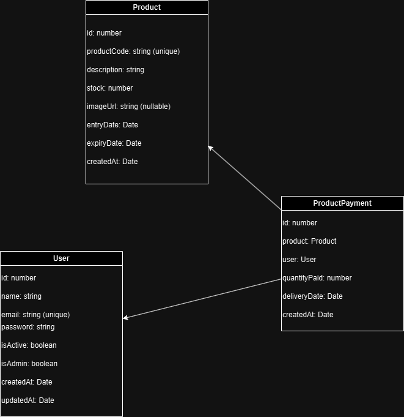

# Controle de Estoque de Produtos

## Índice

1. [Descrição](#descrição)
2. [Tecnologias Utilizadas](#tecnologias-utilizadas)
3. [Requisitos](#requisitos)
4. [MER - Modelo Entidade Relacionamento](#mer---modelo-entidade-relacionamento)
5. [Instruções de Configuração Backend - com Docker](#instruções-de-configuração-backend-e-frontend---com-docker)
6. [Instruções de Configuração Backend - com Docker apenas no banco de dados](#instruções-de-configuração-backend---com-docker-apenas-no-banco-de-dados)
7. [Instruções de Configuração Backend - sem Docker](#instruções-de-configuração-backend---sem-docker)
8. [Instruções de Configuração Frontend](#instruções-de-configuração-frontend)

## Descrição

Este projeto é uma aplicação de controle de estoque de produtos, onde é possível realizar o cadastro de produtos, realizar baixas de entrega de produtos, entre outras funcionalidades.

### Fluxos de Usuário

- **Fluxo de Usuário:** Após o login, o usuário será levado para a tela de dashboard.

## Tecnologias Utilizadas

- Angular
- NestJS
- TypeORM
- PrimeNG
- PrimeFlex
- Docker

## Requisitos

- Docker, Docker Compose, Node.js, npm

## MER - Modelo Entidade Relacionamento

<p align="center">
  
</p>

O arquivo XML para importação no draw.io (app.diagrams.net): [MER.xml](./docs/MER.xml)

## Instruções de Configuração Backend e Frontend - com Docker

1. Clone o repositório:

   ```sh
   git clone https://github.com/brenogonzaga/desafio-digiboard
   ```

2. Rode o comando para iniciar os serviços:

   ```sh
   docker-compose up --build
   ```

3. A aplicação ficará disponível em `http://localhost:3000`.

   **Aguarde alguns segundos para que o backend esteja disponível, pois o Docker realiza verificações de saúde (health check).**

## Instruções de Configuração Backend - com Docker apenas no banco de dados

1. Clone o repositório:

   ```sh
   git clone https://github.com/brenogonzaga/desafio-digiboard
   ```

2. Rode o comando para iniciar os serviços:

   ```sh
   docker-compose -f docker-compose.db.yml up --build
   ```

3. Navegue até o diretório `backend`:

   ```sh
   cd backend
   ```

4. Instale as dependências:

   ```sh
   npm install
   ```

5. Rode o comando para iniciar o backend:

   ```sh
   npm run start:dev
   ```

6. A aplicação ficará disponível em `http://localhost:3000`.

## Instruções de Configuração Frontend

1. Clone o repositório:

   ```sh
   git clone https://github.com/brenogonzaga/desafio-digiboard
   ```

2. Navegue até o diretório `frontend`:

   ```sh
   cd frontend
   ```

3. Instale as dependências:

   ```sh
   npm install
   ```

4. Rode o comando para iniciar o frontend:

   ```sh
   npm start
   ```
